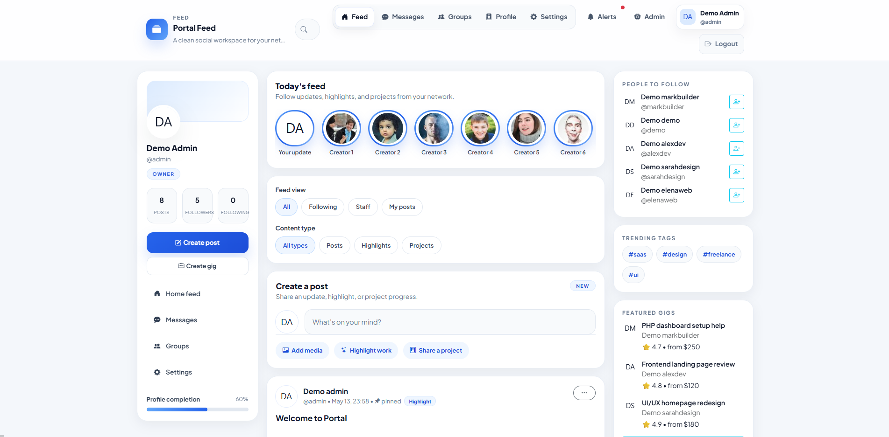

# PortalFeed — PHP Social Community Platform

A modern full-stack social/community platform built with PHP, MySQL, Bootstrap and JavaScript.

Created as a learning + portfolio project focused on social features, clean UI and scalable community systems.

---

# Preview



---

# Features

## Authentication
- Register / login system
- Secure password hashing
- Session authentication
- Role system

## Social Features
- Public feed/posts
- Likes & comments
- Follow / unfollow users
- User profiles
- Notifications

## Community Features
- Groups & communities
- Join/leave groups
- Group discussions

## Messaging
- Direct messaging system
- Conversation threads

## Admin System
- Moderator/admin roles
- Manage users
- Manage posts
- User suspension system

## UI/UX
- Responsive design
- Mobile-friendly layout
- Modern Bootstrap interface
- Guest preview landing page

---

# Tech Stack

- PHP
- MySQL
- Bootstrap 5
- JavaScript
- PDO

---

# Installation

## 1. Clone or download project
Go to root/DB/portal.sql database insert.
Place the project inside:

```txt
htdocs/